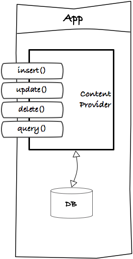

# ContentProviders

- Content providers are a means for IPC (Interprocess communication) on Android.
- The system has several content providers for built-in apps. App authors can also provide their own
  custom content providers as an API.
- In reality, custom content providers are not used frequently because it is often easier and more 
  reliable to share data through a cloud service (like AWS AppSync) etc. Using custom content 
  providers produces runtime dependencies that most users down't want to deal with.

## Using ContentProviders

1. Set the proper permission in the AndroidManifest.xml and request the permission using 
   `ContextCompat.checkSelfPermission` see: <https://developer.android.com/reference/android/Manifest.permission> and <https://developer.android.com/training/permissions/requesting>

   `<uses-permission android:name="android.permission.READ_EXTERNAL_STORAGE"/>`

   ```java
   if (ContextCompat.checkSelfPermission(this, PERMISSION) != PackageManager.PERMISSION_GRANTED) {
   
               // Permission is not granted
               // Should we show an explanation?
               if (ActivityCompat.shouldShowRequestPermissionRationale(this, PERMISSION)) {
                   // Show an explanation to the user *asynchronously* -- don't block
                   // this thread waiting for the user's response! After the user
                   // sees the explanation, try again to request the permission.
               } else {
                   // No explanation needed; request the permission
                   ActivityCompat.requestPermissions(
                       this,
                       new String[]{PERMISSION},
                       MY_PERMISSIONS_REQUEST_ACCESS_MEDIA);
   
                   // MY_PERMISSIONS_REQUEST_READ_CONTACTS is an
                   // app-defined int constant. The callback method gets the
                   // result of the request.
               }
           } else {
               // Permission has already been granted
               readMedia();
           }
   ```

   ```java
   @Override
   public void onRequestPermissionsResult(
       int requestCode, 
       String permissions[], 
       int[] grantResults) {
  
       switch (requestCode) {
           case MY_PERMISSIONS_REQUEST_ACCESS_MEDIA: {
               // If request is cancelled, the result arrays are empty.
               if (grantResults.length > 0
                       && grantResults[0] == PackageManager.PERMISSION_GRANTED) {
                   // permission was granted, yay! Do the
                   // contacts-related task you need to do.
                   readMedia();
               } else {
                   // permission denied, boo! Disable the
                   // functionality that depends on this permission.
               }
               return;
           }
       }
   }
   ```

2. Define a Projection (similar to specifying columns in a SQL SELECT statement)`

   ```java
   private static String[] PROJECTION = new String[] {
           MediaStore.Audio.AudioColumns.ALBUM,
           MediaStore.Audio.AudioColumns.TITLE };
   ```

3. Get a `Cursor` object using `getContentResolver().query` with the proper URL and Projection.

4. Iterate over the cursor using `moveToNext()` etc. or use a CursorAdapter in a RecyclerView

   ```java
   private void readMedia() {
           Cursor cursor = getContentResolver().
               query(MediaStore.Audio.Media.EXTERNAL_CONTENT_URI,
                   PROJECTION, null, null, null);
   
           int idxAlbum = cursor.getColumnIndexOrThrow(
               MediaStore.Audio.AudioColumns.ALBUM);
           int idxTitle = cursor.getColumnIndexOrThrow(
               MediaStore.Audio.AudioColumns.TITLE);
   
           Log.i(TAG, "Media Rows: " + cursor.getCount()) ;
           while (cursor.moveToNext()) {
               String album = cursor.getString(idxAlbum);
               String title = cursor.getString(idxTitle);
               Log.i(TAG, "Album: " + album + " Title: " + title);
           }
       }
   ```

## Custom Content Providers



```java
public class ProviderDemo extends ContentProvider {
  static final String TAG = "ProviderDemo";

  static final String AUTHORITY = "content://com.example.android.lifecycle.providerdemo";
  public static final Uri CONTENT_URI = Uri.parse(AUTHORITY);
  static final String SINGLE_RECORD_MIME_TYPE = "vnd.android.cursor.item/vnd.example.android.lifecycle.status";
  static final String MULTIPLE_RECORDS_MIME_TYPE = "vnd.android.cursor.dir/vnd.example.android.lifecycle.status";

  @Override
  public boolean onCreate() {
    // Used to initialize this content provider. This method runs on UI 
    // thread, so should be quick. Good place to instantiate database 
    // helper, if using database.
    Log.d(TAG, "onCreate");
    return true;
  }

  @Override
  public String getType(Uri uri) {
    // Returns the mime time for the given uri. Typically, this MIME 
    // type will either be something like 
    // vnd.android.cursor.item/vnd.example.android.lifecycle.status for 
    // a single item or
    // vnd.android.cursor.dir/vnd.example.android.lifecycle.status for 
    // multiple items.
    String ret = getContext().getContentResolver().getType(System.CONTENT_URI);
    Log.d(TAG, "getType returning: " + ret);
    return ret;
  }

  @Override
  public Uri insert(Uri uri, ContentValues values) {
    // Inserts the values into the provider returning uri that points to
    // the newly inserted record.
    Log.d(TAG, "insert uri: " + uri.toString());
    return null;
  }

  @Override
  public int update(Uri uri, ContentValues values, String selection,
      String[] selectionArgs) {
    //  Updates records(s) specified by either the uri or selection/
    //  selectionArgs combo. Returns number of records affected.
    Log.d(TAG, "update uri: " + uri.toString());
    return 0;
  }

  @Override
  public int delete(Uri uri, String selection, String[] selectionArgs) {
    // Deletes records(s) specified by either the uri or selection/
    // selectionArgs combo. Returns number of records affected.
    Log.d(TAG, "delete uri: " + uri.toString());
    return 0;
  }

  @Override
  public Cursor query(Uri uri, String[] projection, String selection,
      String[] selectionArgs, String sortOrder) {
    // Queries the provider for the record(s) specified by either uri or
    // selection/selectionArgs/grouping/having combo.
    Log.d(TAG, "query with uri: " + uri.toString());
    return null;
  }

}

```

### Register in AndroidManifest.xml

```xml
<provider
     android:name=".ProviderDemo"
     android:authorities="com.example.android.lifecycle.providerdemo" />
```

### Content URIs

A *content URI* is a URI that identifies data in a provider. It consists of:

- The *scheme*, which is always content:// for a content URI
- The *authority*, which is a unique string identifying the specific content provider
- The *path*, which identifies a particular record or collection of records managed by the provider

In the preceding example, the full URI for the "words" table is:

```
content://user_dictionary/words
```

- content:// — the scheme identifying this as a content URI
- user_dictionary — the authority of the system user dictionary provider
- words — the path corresponding to the “words” table

The ContentResolver uses the authority to identify the ContentProvider to contact.

- An application implementing a ContentProvider specifies the provider’s authority in the 
  application manifest.

The ContentProvider uses the path to choose the table to access.

- A provider usually has a path for each table it exposes.

- Many providers allow you to access a single row in a table by appending an ID value to the end of 
  the URI.

- For example, to retrieve a row whose _ID is 4 from user dictionary, you can use this content URI:

  ```java
  Uri singleUri = ContentUri.withAppendedId(UserDictionary.Words.CONTENT_URI,4);
  ```

  **Note**: The [Uri](http://developer.android.com/reference/android/net/Uri.html) and 
  [Uri.Builder](http://developer.android.com/reference/android/net/Uri.Builder.html) classes contain
  convenience methods for constructing well-formed Uri objects from strings. The 
  [ContentUris](http://developer.android.com/reference/android/content/ContentUris.html) class 
  contains convenience methods for appending id values to a URI. The previous snippet uses 
  withAppendedId() to append an id to the UserDictionary content URI.